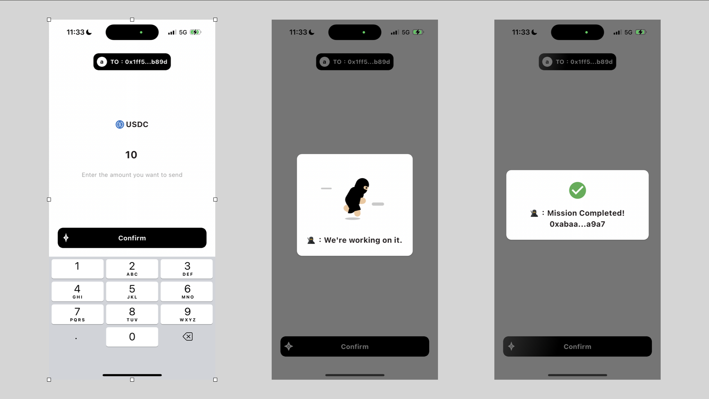
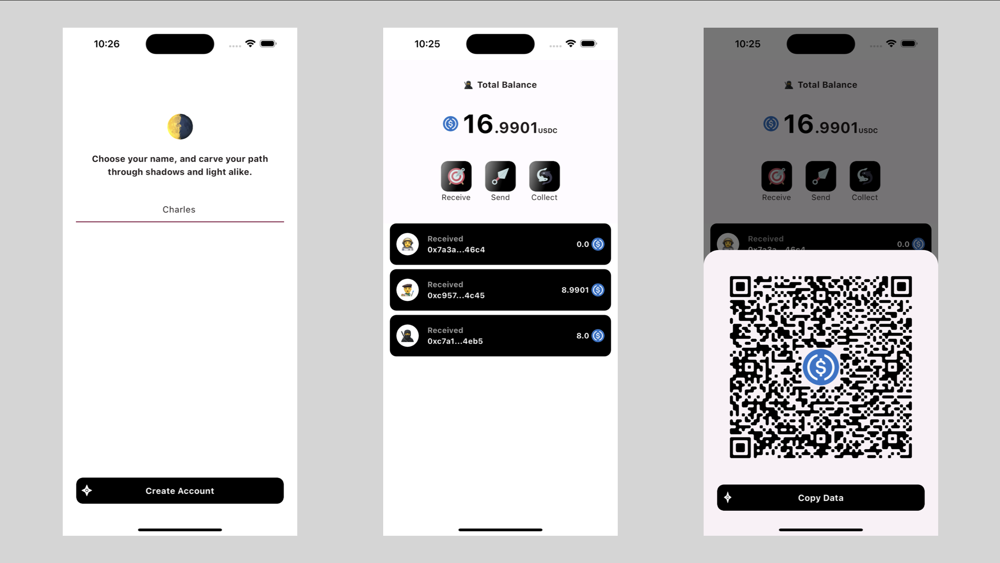
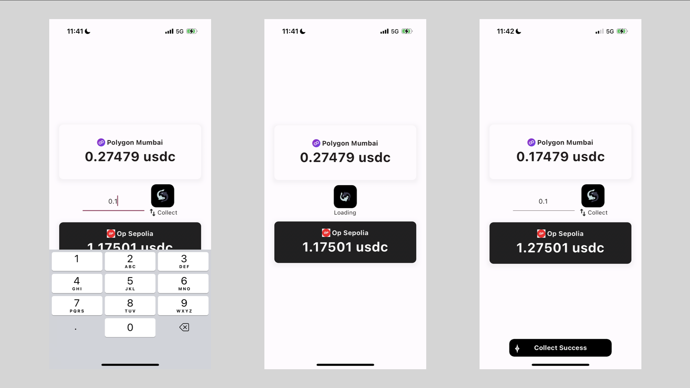

# kage-pay


Kage-Pay offers a secure and user-friendly blockchain payment solution for face-to-face transactions, featuring gasless transactions through stablecoin-based fees, and cross-chain functionality by Circle CCTP to simplify managing assets across different blockchains. It employs stealth address technology for privacy and utilizes smartphones for secure transaction management, aiming to enhance blockchain usability and adoption.

## Screenshots








## Contracts

### Current Contract Addresses

#### Polygon Mumbai

- Account Factory: `0x08E6B84a66008A3761C740cE8B772128aE91fD30`
- ERC 5564 Announcer: `0x1c6559013B51A1bF86D4180Fb7a5dF428f699DC1`
- Paymaster: `0xa4Fe52677f2109e1704E765a790619f432BeF959`

#### Optimistic Sepolia

- Account Factory: `0x1c6559013B51A1bF86D4180Fb7a5dF428f699DC1`
- ERC 5564 Announcer: `0xa4Fe52677f2109e1704E765a790619f432BeF959`
- Paymaster: `0x6f4f6594437d285fa5C7529CE8602Da68d72336f`

#### Scroll Sepolia

- USDC: `0x08E6B84a66008A3761C740cE8B772128aE91fD30`
- Account Factory: `0x1c6559013B51A1bF86D4180Fb7a5dF428f699DC1`
- ERC 5564 Announcer: `0xa4Fe52677f2109e1704E765a790619f432BeF959`
- Paymaster: `0x6f4f6594437d285fa5C7529CE8602Da68d72336f`

#### Linea Goerli

- USDC: `0x586b31774d15ee066c95D22A72A5De71eAA95125`
- Account Factory: `0x08E6B84a66008A3761C740cE8B772128aE91fD30`
- ERC 5564 Announcer: `0x1c6559013B51A1bF86D4180Fb7a5dF428f699DC1`
- Paymaster: Unable to deploy due to no entrypoint.

#### Zircuit

- USDC: `0x586b31774d15ee066c95D22A72A5De71eAA95125`
- Account Factory: `0x6f4f6594437d285fa5C7529CE8602Da68d72336f`
- ERC 5564 Announcer: `0xe9eCB0D3A8fDa1267efbb130499Ab807ca643856`
- Paymaster: Unable to deploy due to no entrypoint.

### Deploy Contracts

Examples:

1. `./script/deploy.sh -chain=eth-sepolia -contract=account-factory`

1. `./script/deploy.sh -chain=eth-sepolia -contract=erc-5564-announcer`

1. `./script/deploy.sh -chain=eth-sepolia -contract=paymaster`

### Setup Paymaster

1. Set up `{chain_name}_PAYMASTER_CONTRACT_ADDRESS` and run `./script/paymaster-setup.sh {chain_name}`

Or, manually:

1. Update prices from oracle:

   ```bash
   cast send {contract_address} "updateCachedPrice(bool)" "false" --rpc-url {rpc_url} --private-key={PRIVATE_KEY}
   ```

1. Deposit some ether for paymaster to spend:

   ```bash
   cast send {contract_address} "deposit()" --value 0.1ether --rpc-url {rpc_url} --private-key={PRIVATE_KEY}
   ```

1. When the paymaster is no more needed, withdraw ether from entrypoint:

   ```bash
   cast send {contract_address} "withdrawTo(address, uint256)" "{owner_address}" "0.1ether" --rpc-url {rpc_url} --private-key={PRIVATE_KEY}
   ```
